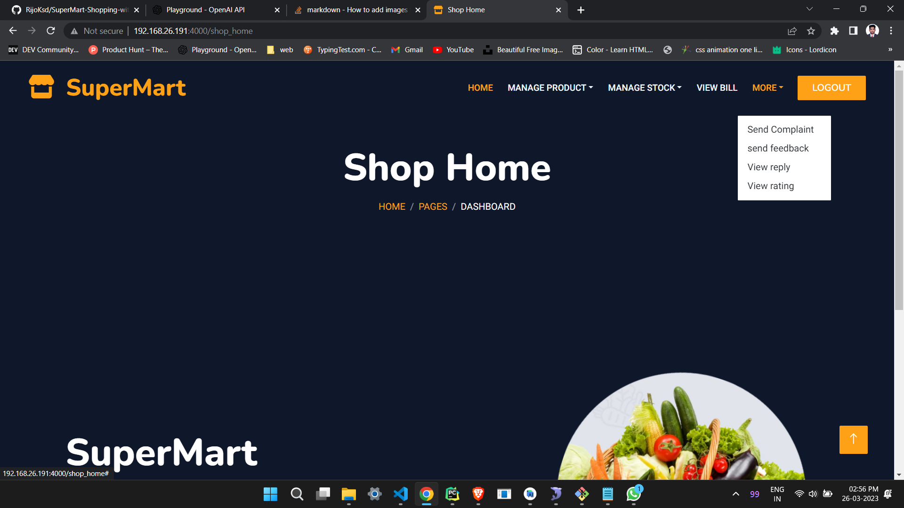
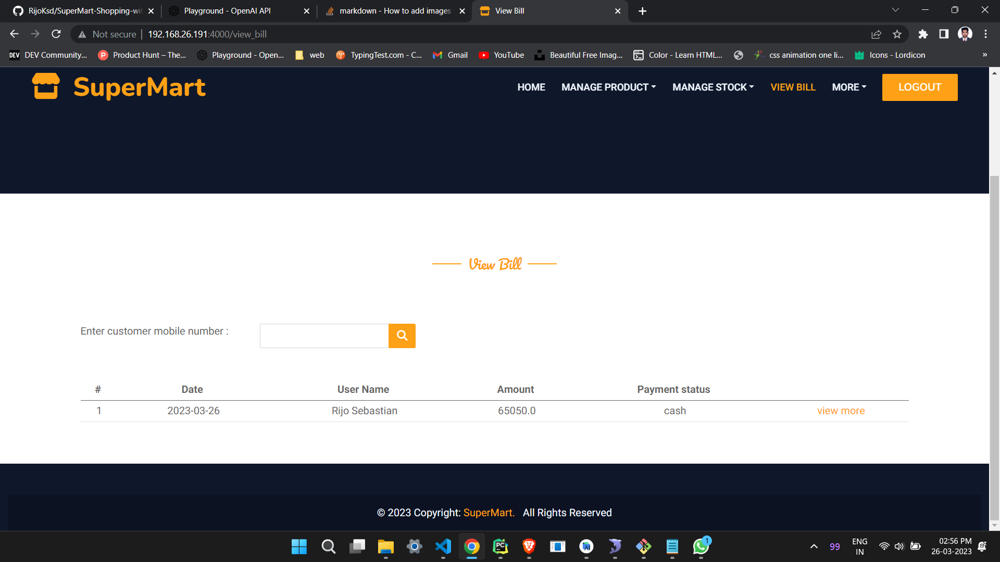
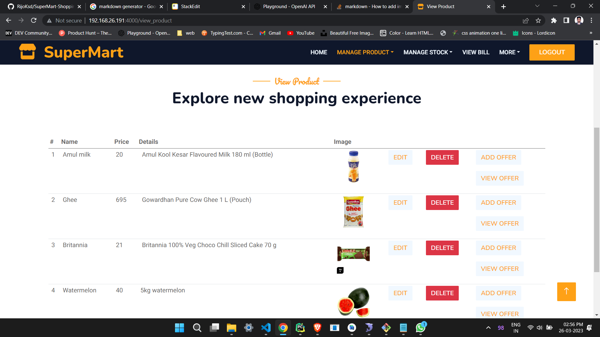
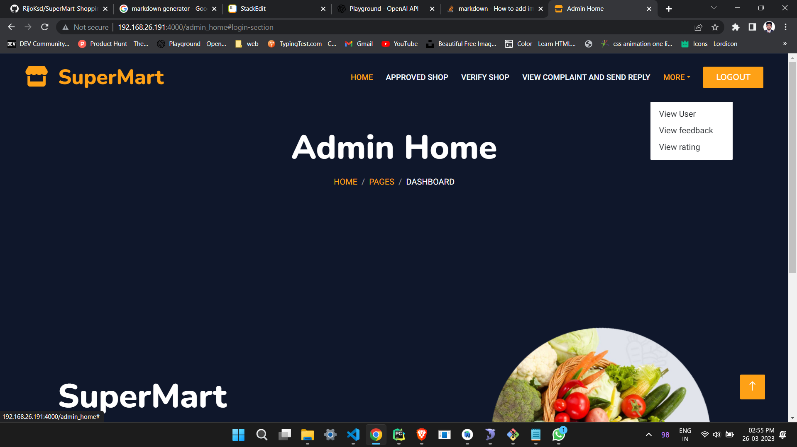
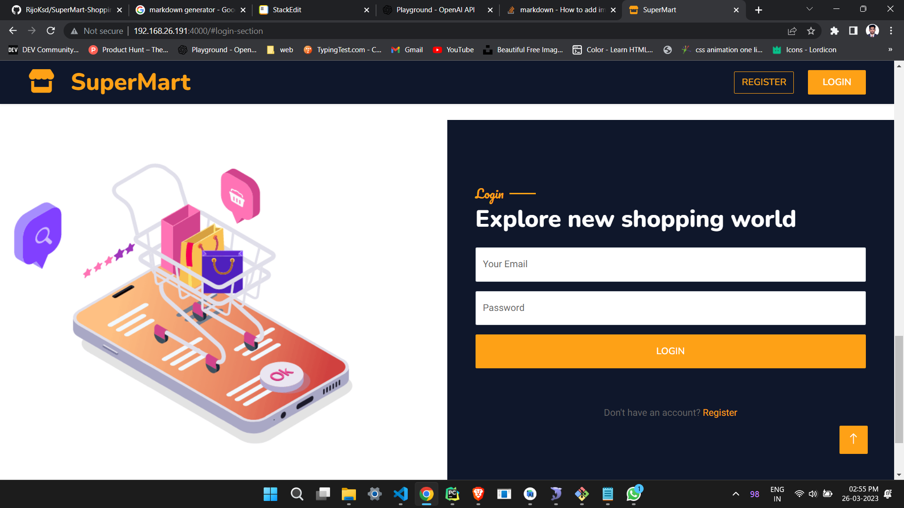
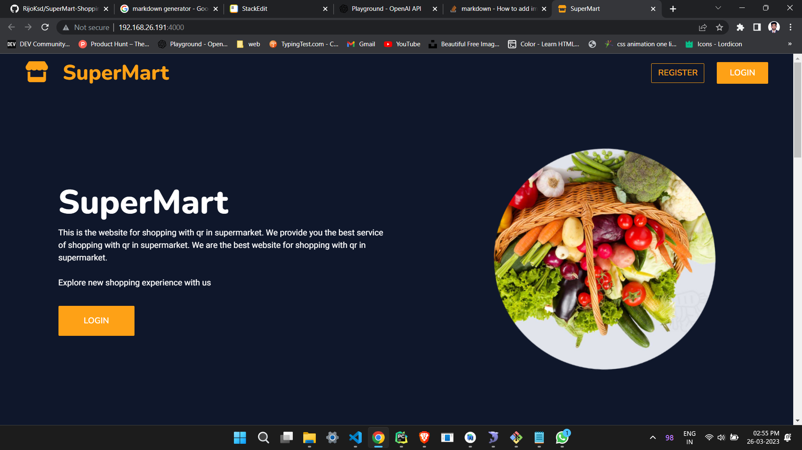

  # SuperMart

SuperMart is my final year computer science project for shopping with QR code. With this app, users can shop the product from supermarkets with ease. There is a QR code scan section in my Android app, by using it the user can scan the product and add quantity and add to cart, user can also add product to cart without scanning. This app shows every product   details in the app
   * Users can select products from a variety of shopkeepers on the website.  
   * Once the user adds the product to their cart and presses the “booked” button, a request is sent to the shopkeeper’s bill section in the website . 
 * The shopkeeper needs to verify the product and the product quantity before they can proceed.
 * Once the shopkeeper presses the “verified” button, the user can proceed to the payment section in the Android app and make the payment either online or offline.  

##  This project contains three modules: an admin section, a user section, and a shop section.
*  The shop and admin sections are web applications built using Python Flask, while the user section is an Android application built using Java Android Studio.
*   The admin can perform a variety of tasks, such as verifying shops, deleting and blocking/unblocking shops, sending replies to user and shop complaints, viewing feedback from users and shops, viewing shops’ ratings given by users, and viewing users and shops. 
*  The shop can add products after they’ve been verified, add offers to products, add stock to products, update stock, offers, and products, view user ratings, and view previous bills.  
* The user in the Android section can view their profile, log in and register, view verified shops, view products, add items to their cart, send shop ratings, add feedback and complaints, and scan QR codes to purchase products.
* When a shop adds a new product, a QR code will be generated for that product. The user can then scan the QR code to add the product to their cart.

## Technologies Used
* Frontend: HTML, CSS, JavaScript
* Backend: Python Flask
* Database: MySQL
* Android: Java, Android Studio
* Apps: Android Studio, Pycharm, SQL Log
* Local Server: WAMP
* Programming Language: Python 3.8
## Installation

To install SuperMart, you will need the following software:

- Android Studio for building the Android app
- PyCharm for the Flask application
- SQLLog for the database
- Wamp for the local server
- Python 3.8 width="100"
<!-- 

 
 -->

|Android  | Web  |
|--|--|
| | | 
| | | 
 